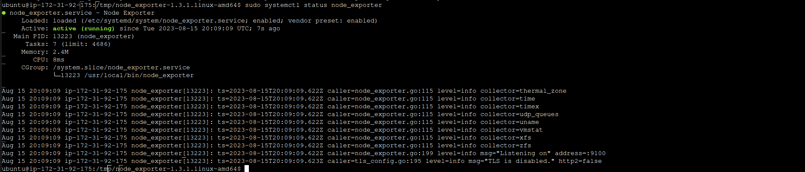

# PROMETHEUS LAB 1
### 1) what is differnect http status code and explain meaning of each of them ?
1. **1xx Informational Responses:** These codes indicate that the server has received the request and is continuing to process it.
2. **2xx Successful Responses:** These codes indicate that the request was successfully received, understood, and accepted.
3. **3xx Redirection Responses:** These codes indicate that further action needs to be taken by the client to fulfill the request.
4. **4xx Client Error Responses:** These codes indicate that the client has made an error or the request cannot be fulfilled by the server.
5. **5xx Server Error Responses:** These codes indicate that the server failed to fulfill a valid request.

-----

### 2) What database is used by Prometheus?
- **Prometheus Time Series Database (TSDB):** This database is designed specifically for handling and storing time-series data, It's optimized for high-throughput ingestion of time-stamped data and efficient querying of historical data.

-----

### 3) what is the differnece between different metrics types ( counter , gauge , histogram) ?
- **Counter** is for continuously increasing counts, often representing the total number of occurrences of an event.
- **Gauge** is for measuring values that can go up and down, providing a snapshot of a specific value at a moment in time.
- **Histogram** is for analyzing the distribution of values in a dataset, useful for understanding the variability and patterns within the data.

-----

### 4) install prometheus on your localhost or on server in any cloud provider.

-----

### 5) add any new target to prometheus.yaml file and apply any query on it using promql langauge. 

